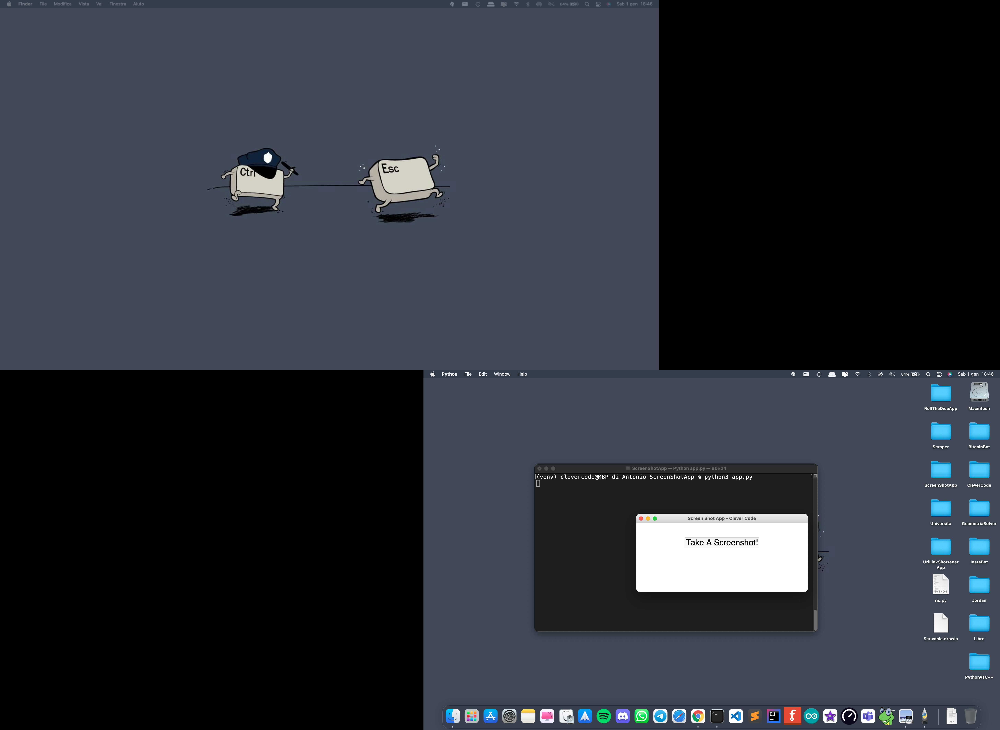

# ScreenshotApp
Simple Screenshot App With Python Tkinter

Example (All Monitors in one Screenshot):

  

# Per maggiori informazioni

Youtube: [ScreenshotApp With Python Tkinter](https://www.youtube.com/watch?v=OxT-FOJvsLY&ab_channel=CleverCode)

Created By Antonio Bernardini Copyright© 2021
